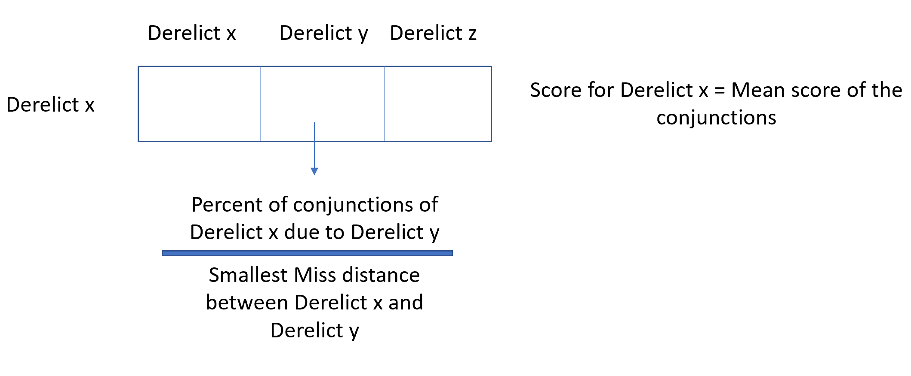

```{r include=F}
knitr::opts_chunk$set(echo=F)
knitr::opts_chunk$set(warning=F)
knitr::opts_chunk$set(message=F)
setwd("C:/Users/Harri/OneDrive/Documents/C2_metric/")
library(tidyverse)
library(readr)
library(kableExtra)
library(knitr)
library(lubridate)
library(DT)
library(RColorBrewer)
library(stringr)
library(scales)
Sys.setenv(TZ='EST')
all_conjs =readRDS("~/centauri/conjunction_analysis/RDSfiles/all_conjs")
mcma_objs = readRDS("~/centauri/conjunction_analysis/RDSfiles/mcma_objs")

```
<font size = "5">The following metric calculates how coupled a derelict is within the cluster. The conjunctions of each derelict are scored by dividing the percentage of conjunctions due to the specific derelict, divided by that conjunctions smallest miss distance, as shown in the figure below. The average score of the all the derelicts conjunctions are then used to rank them against the other derelicts in the cluster. </font>


```{r warning = FALSE}
#set up all_poss data frames

nonpure_cluster = subset(mcma_objs,cluster_new == "cc1500"| cluster_new == "cc775"| cluster_new == "cc850"| cluster_new == "cc975" | cluster_new == "cc615" | cluster_new == "cc1200" )

cluster_615_ap = subset(nonpure_cluster, cluster_new == "cc615")
cluster_775_ap = subset(nonpure_cluster, cluster_new == "cc775")
cluster_850_ap = subset(nonpure_cluster, cluster_new == "cc850")
cluster_975_ap = subset(nonpure_cluster, cluster_new == "cc975")
cluster_1200_ap = subset(nonpure_cluster, cluster_new == "cc1200")
cluster_1500_ap = subset(nonpure_cluster, cluster_new == "cc1500")

list_der_615 = cluster_615_ap[,c(1,3)]
list_der_615$noradId = paste0(list_der_615$noradId, "--", list_der_615$name)
list_der_615 = subset(list_der_615, select = -c(2) )
list_der_775 = cluster_775_ap[,c(1,3)]
list_der_775$noradId = paste0(list_der_775$noradId, "--", list_der_775$name)
list_der_775 = subset(list_der_775, select = -c(2) )
list_der_850 = cluster_850_ap[,c(1,3)]
list_der_850$noradId = paste0(list_der_850$noradId, "--", list_der_850$name)
list_der_850 = subset(list_der_850, select = -c(2) )
list_der_975 = cluster_975_ap[,c(1,3)]
list_der_975$noradId = paste0(list_der_975$noradId, "--", list_der_975$name)
list_der_975 = subset(list_der_975, select = -c(2) )
list_der_1200 = cluster_1200_ap[,c(1,3)]
list_der_1200$noradId = paste0(list_der_1200$noradId, "--", list_der_1200$name)
list_der_1200 = subset(list_der_1200, select = -c(2) )
list_der_1500 = cluster_1500_ap[,c(1,3)]
list_der_1500$noradId = paste0(list_der_1500$noradId, "--", list_der_1500$name)
list_der_1500 = subset(list_der_1500, select = -c(2) )


list_der_615$name2 = list_der_615$noradId
list_der_775$name2 = list_der_775$noradId
list_der_850$name2 = list_der_850$noradId
list_der_975$name2 = list_der_975$noradId
list_der_1200$name2 = list_der_1200$noradId
list_der_1500$name2 = list_der_1500$noradId

all_poss615 = expand.grid(list_der_615)
all_poss775 = expand.grid(list_der_775)
all_poss850 = expand.grid(list_der_850)
all_poss975 = expand.grid(list_der_975)
all_poss1200 = expand.grid(list_der_1200)
all_poss1500 = expand.grid(list_der_1500)

all_conjs_615 = subset(all_conjs, all_conjs$clusterLab == "615")
all_conjs_775 = subset(all_conjs, all_conjs$clusterLab == "775")
all_conjs_850 = subset(all_conjs, all_conjs$clusterLab == "850")
all_conjs_975 = subset(all_conjs, all_conjs$clusterLab == "975")
all_conjs_1200 = subset(all_conjs, all_conjs$clusterLab == "1200")
all_conjs_1500 = subset(all_conjs, all_conjs$clusterLab == "1500")
```

## cc615
```{r warning=FALSE}
#cc615
b = data.frame()

for(i in 1:nrow(all_poss615)) {
 a = sum(all_conjs_615$PrimarySatellite == all_poss615[i,1] & all_conjs_615$SecondarySatellite == all_poss615[i,2]) + sum(all_conjs_615$PrimarySatellite == all_poss615[i,2] & all_conjs_615$SecondarySatellite == all_poss615[i,1])
b[i,1] = a
b[i,2] = sum(all_conjs_615$PrimarySatellite == all_poss615[i,1]) + sum(all_conjs_615$SecondarySatellite == all_poss615[i,1])
}

b$numofconjs = b$V2
b$percconjs = (b$V1/b$numofconjs)*100

for(i in 1:nrow(all_poss615)){
 c = subset(all_conjs_615, all_conjs_615$PrimarySatellite == all_poss615[i,1] & all_conjs_615$SecondarySatellite == all_poss615[i,2])
 d = subset(all_conjs_615, all_conjs_615$PrimarySatellite == all_poss615[i,2] & all_conjs_615$SecondarySatellite == all_poss615[i,1])
 b[i,5] = min(if_else(nrow(c) > 0, min(c$Range), 100), if_else(nrow(d) > 0, min(d$Range), 100))
}

b$minconj = b$V5
b$derelict = all_poss615$noradId
b$totscore_1 = b$percconjs/b$minconj
final_score_2 = data.frame(list_der_615$noradId)

for(i in 1:nrow(final_score_2)){
  e = subset(b, b$derelict == final_score_2[i,1])
  final_score_2[i,2] = mean(e$totscore_1)
}

final_score_2 = final_score_2[order(-final_score_2$V2),]
DT::datatable(final_score_2[,c(1,2)], colnames = c("NoradID","Mean Score"), rownames = FALSE)
```

## cc775
```{r warning=FALSE}
#cc775
bb = data.frame()
for(i in 1:nrow(all_poss775)) {
 ab = sum(all_conjs_775$PrimarySatellite == all_poss775[i,1] & all_conjs_775$SecondarySatellite == all_poss775[i,2]) + sum(all_conjs_775$PrimarySatellite == all_poss775[i,2] & all_conjs_775$SecondarySatellite == all_poss775[i,1])
bb[i,1] = ab
bb[i,2] = sum(all_conjs_775$PrimarySatellite == all_poss775[i,1]) + sum(all_conjs_775$SecondarySatellite == all_poss775[i,1])
}

bb$numofconjs = bb$V2
bb$percconjs = (bb$V1/bb$numofconjs)*100
bb[is.na(bb)] <- 0

for(i in 1:nrow(all_poss775)){
 cb = subset(all_conjs_775, all_conjs_775$PrimarySatellite == all_poss775[i,1] & all_conjs_775$SecondarySatellite == all_poss775[i,2])
 db = subset(all_conjs_775, all_conjs_775$PrimarySatellite == all_poss775[i,2] & all_conjs_775$SecondarySatellite == all_poss775[i,1])
 bb[i,5] = min(if_else(nrow(cb) > 0, min(cb$Range), 100), if_else(nrow(db) > 0, min(db$Range), 100))
}

bb$minconj = bb$V5
bb$derelict = all_poss775$noradId
bb$totscore_1 = bb$percconjs/bb$minconj
final_score_775 = data.frame(list_der_775$noradId)
for(i in 1:nrow(final_score_775)){
  eb = subset(bb, bb$derelict == final_score_775[i,1])
  final_score_775[i,2] = mean(eb$totscore_1)
}
final_score_775 = final_score_775[order(-final_score_775$V2),]
DT::datatable(final_score_775[,c(1,2)], colnames = c("NoradID","Mean Score"), rownames = FALSE)
```

## cc850
```{r warning= FALSE}
#cc850
bc = data.frame()
for(i in 1:nrow(all_poss850)) {
 ac = sum(all_conjs_850$PrimarySatellite == all_poss850[i,1] & all_conjs_850$SecondarySatellite == all_poss850[i,2]) + sum(all_conjs_850$PrimarySatellite == all_poss850[i,2] & all_conjs_850$SecondarySatellite == all_poss850[i,1])
bc[i,1] = ac
bc[i,2] = sum(all_conjs_850$PrimarySatellite == all_poss850[i,1]) + sum(all_conjs_850$SecondarySatellite == all_poss850[i,1])
}

bc$numofconjs = bc$V2
bc$percconjs = (bc$V1/bc$numofconjs)*100
bc[is.na(bc)] <- 0

for(i in 1:nrow(all_poss850)){
 cc = subset(all_conjs_850, all_conjs_850$PrimarySatellite == all_poss850[i,1] & all_conjs_850$SecondarySatellite == all_poss850[i,2])
 dc = subset(all_conjs_850, all_conjs_850$PrimarySatellite == all_poss850[i,2] & all_conjs_850$SecondarySatellite == all_poss850[i,1])
 bc[i,5] = min(if_else(nrow(cc) > 0, min(cc$Range), 100), if_else(nrow(dc) > 0, min(dc$Range), 100))
}

bc$minconj = bc$V5
bc$derelict = all_poss850$noradId
bc$totscore_1 = bc$percconjs/bc$minconj
final_score_850 = data.frame(list_der_850$noradId)
for(i in 1:nrow(final_score_850)){
  ec = subset(bc, bc$derelict == final_score_850[i,1])
  final_score_850[i,2] = mean(ec$totscore_1)
}
final_score_850 = final_score_850[order(-final_score_850$V2),]
DT::datatable(final_score_850[,c(1,2)], colnames = c("NoradID","Mean Score"), rownames = FALSE)

```

## cc975
```{r warning=FALSE}
#cc975
bd = data.frame()
for(i in 1:nrow(all_poss975)) {
 ad = sum(all_conjs_975$PrimarySatellite == all_poss975[i,1] & all_conjs_975$SecondarySatellite == all_poss975[i,2]) + sum(all_conjs_975$PrimarySatellite == all_poss975[i,2] & all_conjs_975$SecondarySatellite == all_poss975[i,1])
bd[i,1] = ad
bd[i,2] = sum(all_conjs_975$PrimarySatellite == all_poss975[i,1]) + sum(all_conjs_975$SecondarySatellite == all_poss975[i,1])
}

bd$numofconjs = bd$V2
bd$percconjs = (bd$V1/bd$numofconjs)*100
bd[is.na(bd)] <- 0

for(i in 1:nrow(all_poss975)){
 cd = subset(all_conjs_975, all_conjs_975$PrimarySatellite == all_poss975[i,1] & all_conjs_975$SecondarySatellite == all_poss975[i,2])
 dd = subset(all_conjs_975, all_conjs_975$PrimarySatellite == all_poss975[i,2] & all_conjs_975$SecondarySatellite == all_poss975[i,1])
 bd[i,5] = min(if_else(nrow(cd) > 0, min(cd$Range), 100), if_else(nrow(dd) > 0, min(dd$Range), 100))
}

bd$minconj = bd$V5
bd$derelict = all_poss975$noradId
bd$totscore_1 = bd$percconjs/bd$minconj
final_score_975 = data.frame(list_der_975$noradId)
for(i in 1:nrow(final_score_975)){
  ed = subset(bd, bd$derelict == final_score_975[i,1])
  final_score_975[i,2] = mean(ed$totscore_1)
}
final_score_975 = final_score_975[order(-final_score_975$V2),]
DT::datatable(final_score_975[,c(1,2)], colnames = c("NoradID","Mean Score"), rownames = FALSE)

```

## cc1200
```{r warning=FALSE}

#cc1200
be = data.frame()
for(i in 1:nrow(all_poss1200)) {
 ae = sum(all_conjs_1200$PrimarySatellite == all_poss1200[i,1] & all_conjs_1200$SecondarySatellite == all_poss1200[i,2]) + sum(all_conjs_1200$PrimarySatellite == all_poss1200[i,2] & all_conjs_1200$SecondarySatellite == all_poss1200[i,1])
be[i,1] = ae
be[i,2] = sum(all_conjs_1200$PrimarySatellite == all_poss1200[i,1]) + sum(all_conjs_1200$SecondarySatellite == all_poss1200[i,1])
}

be$numofconjs = be$V2
be$percconjs = (be$V1/be$numofconjs)*100
be[is.na(be)] <- 0

for(i in 1:nrow(all_poss1200)){
 ce = subset(all_conjs_1200, all_conjs_1200$PrimarySatellite == all_poss1200[i,1] & all_conjs_1200$SecondarySatellite == all_poss1200[i,2])
 de = subset(all_conjs_1200, all_conjs_1200$PrimarySatellite == all_poss1200[i,2] & all_conjs_1200$SecondarySatellite == all_poss1200[i,1])
 be[i,5] = min(if_else(nrow(ce) > 0, min(ce$Range), 100), if_else(nrow(de) > 0, min(de$Range), 100))
}

be$minconj = be$V5
be$derelict = all_poss1200$noradId
be$totscore_1 = be$percconjs/be$minconj
final_score_1200 = data.frame(list_der_1200$noradId)
for(i in 1:nrow(final_score_1200)){
  ee = subset(be, be$derelict == final_score_1200[i,1])
  final_score_1200[i,2] = mean(ee$totscore_1)
}
final_score_1200 = final_score_1200[order(-final_score_1200$V2),]
DT::datatable(final_score_1200[,c(1,2)], colnames = c("NoradID","Mean Score"), rownames = FALSE)

```

## cc1500
```{r warning=FALSE}

#cc1500
bf = data.frame()
for(i in 1:nrow(all_poss1500)) {
 af = sum(all_conjs_1500$PrimarySatellite == all_poss1500[i,1] & all_conjs_1500$SecondarySatellite == all_poss1500[i,2]) + sum(all_conjs_1500$PrimarySatellite == all_poss1500[i,2] & all_conjs_1500$SecondarySatellite == all_poss1500[i,1])
bf[i,1] = af
bf[i,2] = sum(all_conjs_1500$PrimarySatellite == all_poss1500[i,1]) + sum(all_conjs_1500$SecondarySatellite == all_poss1500[i,1])
}

bf$numofconjs = bf$V2
bf$percconjs = (bf$V1/bf$numofconjs)*100
bf[is.na(bf)] <- 0

for(i in 1:nrow(all_poss1500)){
 cf = subset(all_conjs_1500, all_conjs_1500$PrimarySatellite == all_poss1500[i,1] & all_conjs_1500$SecondarySatellite == all_poss1500[i,2])
 df = subset(all_conjs_1500, all_conjs_1500$PrimarySatellite == all_poss1500[i,2] & all_conjs_1500$SecondarySatellite == all_poss1500[i,1])
 bf[i,5] = min(if_else(nrow(cf) > 0, min(cf$Range), 100), if_else(nrow(df) > 0, min(df$Range), 100))
}

bf$minconj = bf$V5
bf$derelict = all_poss1500$noradId
bf$totscore_1 = bf$percconjs/bf$minconj
final_score_1500 = data.frame(list_der_1500$noradId)
for(i in 1:nrow(final_score_1500)){
  ef = subset(bf, bf$derelict == final_score_1500[i,1])
  final_score_1500[i,2] = mean(ef$totscore_1)
}
final_score_1500 = final_score_1500[order(-final_score_1500$V2),]
DT::datatable(final_score_1500[,c(1,2)], colnames = c("NoradID","Mean Score"), rownames = FALSE)

```